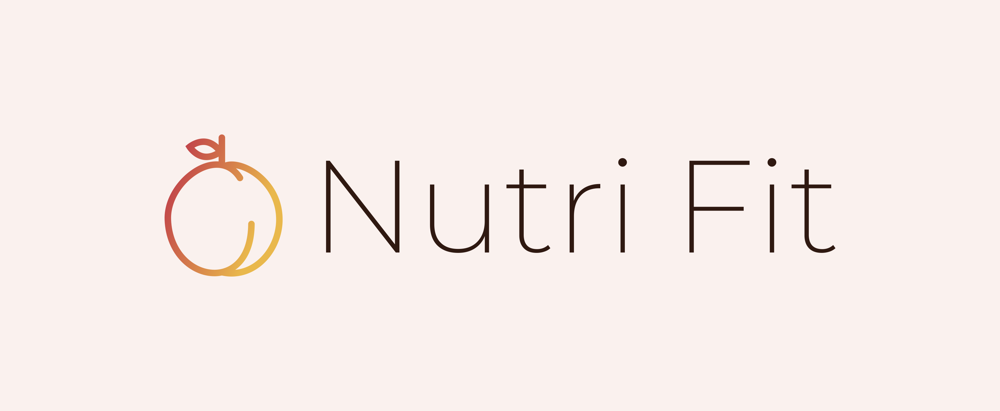
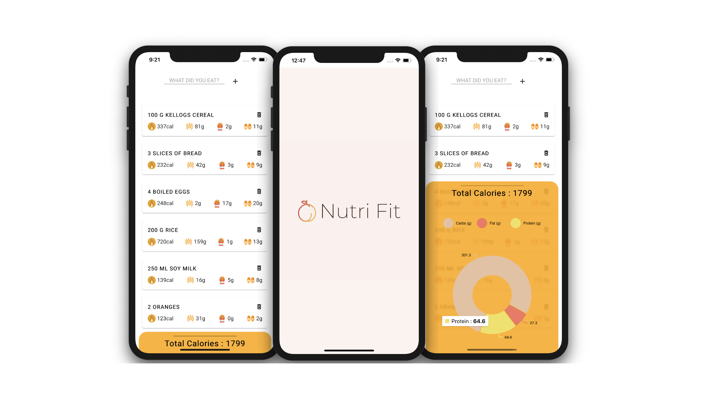

<p align="center">
  
</p>


Nutri Fit is a nutrition tracking app that helps users calculate the amount of macros and calories from the food consumed.

## Screenshots

<p align="center">
  
</p>


## Getting started

1. Clone the repo

```
https://github.com/dalmia007/nutri-fit-client.git
cd client
```

2. Install dependencies

```
npm install
```

3. Go to (https://developer.edamam.com/food-database-api) and create an account of your choice to obtain the APP_KEY and APP_ID. After that create a .env file in the root folder and paste the keys in the following format:

```
REACT_APP_API_KEY = Your App Key
REACT_APP_APP_ID = Your App ID
```


4. Start development server

```
npm start
```


## Built with

* [React](https://reactjs.org) - Front end library for building user interfaces
* [Material UI](https://material-ui.com) - React components for faster and easier web development.
* Love, lots of love ♥


## Contributing

Improvements are welcome :)

Fork the repo and do your thing. Push to your fork and submit a pull request.


## Author

Anurag Dalmia - [Github](https://github.com/dalmia007) - [LinkedIn](https://www.linkedin.com/in/anurag-dalmia/)


## License

This project is licensed under the MIT License.
